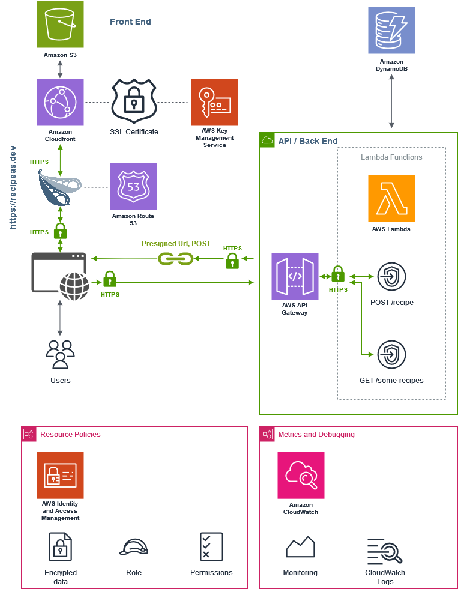

# Reci-peas, basic recipe sharing app

Reci-peas started out as a take-home assignment for the Roulettech interview process. I was given a week to make a React app, Django back-end, and host them on S3 and EC2 respectively. I probably went overboard with the styling and functionality and didn't finish in time, but decided to stick it out and finish it anyways. It took two weeks instead.

## Some issues that held me up

### Responsive CSS

I spent an inordinate amount of time making sure the CSS looked perfect on every browser width and on mobile. I've never been a fan of CSS. No matter how well I feel like I grasp it, it always only gets me to a rough approximation of the vision. But this was the most trivial problem.

### AWS Lambda and API Gateway

I feel like using EC2 to host Django for a couple simple endpoints is overkill in a modern app. Nobody is going to be using this app except me, when testing, and a few unlucky fellas that happen to come across it due to curiosity. It doesn't make sense to keep a server that's always on. So instead of Django and EC2, I wrote some Python code into a couple AWS Lambda endpoints routed into the AWS API Gateway, which is helpful for several reasons:

- I can configure both endpoints with the same CORS settings.
- Cloudwatch Logs were very useful for debugging.
- Throttling the rate limit down to 1 request per second makes it harder for anyone to DDOS me (who knows). At the very least, it already saved me once from an infinite refresh loop. That 429 "Too Many Requests" was the most comforting HTTP error I've experienced. 
- It gives me monitoring tools out of the box, which I use as a sanity check.

### AWS DynamoDB

In line with the serverless design, DynamoDB provides an inexpensive key-value store without having a full-time server. The downsides are that it's a accompanied with a paradigm shift in design, and its documentation is written rather confusingly. For example, within the partition size limit of 10GB, it would seem faster to set the table partition key to a static value in order to use the API method "Query" instead of "Scan", since this ensures the items would be stored in the same partition. On face value, the two API methods seem nearly identical.

### Presigned POST requests on S3

The most intuitive way to store images might have been to simply save the blobs into the database. But this is also expensive. So instead, we might save the images to S3 and reference the URL in the database. But uploading the images to Lambda, then processing the images to S3 takes twice the bandwidth and processing. Instead, the best way is to let the Lambda function notify S3 to provide "pre-signed URLs", return the URLs to the client, then let the client upload the images directly to S3. Then, there is a particular way to do this if we want to limit the specific file to upload (so a malicious user doesn't try to upload a 5GB file), by providing S3 with a MD5 and file size in advance.

## Tech stack

This app was written with **React** in the front end and **Python** for the serverless functions. If I were to start over without the context of this being an interview take-home, I would have used Next.js instead of plain React, or even Sveltekit (which I prefer).

## Architecture

The diagram below was made with [draw.io](https://app.diagrams.net). It had all the AWS service icons, but drawing the paths were a pain.



### Installing

Don't, but if you need to...
```
npm install
npm run dev
```

And if the environment variables weren't saved (because I did something right for once), then there's a `VITE_GET_RECIPES_URL` and `VITE_POST_RECIPE_URL` for the two endpoints.

## Author
  
**Jonathan Chang** - [@jachang820](https://github.com/jachang820)
